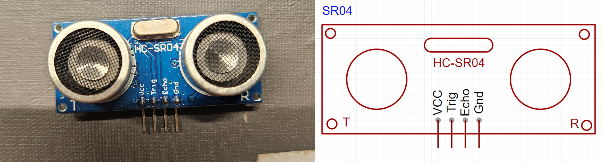

> [!IMPORTANT]
>
>This project was part of my coursework. Since the course has ended, it will no longer be updated.


# SR04_Driver

A MicroPython SR04 Ultrasonic Distance Sensor driver.

SR04 not like other similar sensors, SR04 not use any bus protocols. SR04 use pulse time to return result.  A typical 
SR04 Sensor like:



## How to use

Create an SR04 object. Then use `SR04.measure_centimeter()` to get data.

## How SR04 Measuring

Before measuring, SR04 need to initialize. To initialize properly, SR04 must connect ground first and wait 1 second 
after connecting the power. After initializing, give `Trig` pin 10μs HIGH pulse to trigger measurement. Then `Echo` pin 
will set HIGH when received reflected ultrasonic. Measuring `Echo` pin's HIGH pulse time to get ultrasonic reflected 
back time.

To get distance $d$, need to calculate with speed of sound $C$ and `Echo` pin's pulse time $t_{echo}$, like:

$$
d = C \frac{t_{echo}}{2}
$$

For example, to get centimeter distance:

$$
d = \frac{1}{2} \times 0.034 cm/μs \times t_{echo} μs
$$

$$
d = 0.017 \times t_{echo}(cm)
$$

SR04's accuracy is 3mm and max measuring distance is 4 meter, so keeping one decimal place is necessary:

$$
d = \mathrm{round}(0.017 \times t_{echo}, 1)
$$

## Compensation Error

For the speed of sound $C$, it's about $340 m/s$ when air is 15℃ and at 1atm. Normally, $340 m/s$'s accuracy is enough.
But for extreme conditions, speed of sound $C$ need compensation. $T$ is temperature in ℃:

$$
c_{fixed} = C \times \sqrt{1 + \frac{T}{273}} \approx 331.4 + 0.607T(m/s)
$$

Here is relationship between speed of sound and common temperature:

| Temperature(℃) | Speed of sound(m/s) |
|:--------------:|:-------------------:|
|      -30       |         313         |
|      -20       |         319         |
|      -10       |         325         |
|       0        |         332         |
|       10       |         338         |
|       15       |         340         |
|       20       |         344         |
|       30       |         349         |
|      100       |         386         |

To apply compensation, need to give speed of sound param when construct an object:

```python
from library.SR04_driver.sr04_driver import SR04
from machine import Pin
driver = SR04(pin_trig=Pin(14),
              pin_echo=Pin(2),
              speed_of_sound=344)
```